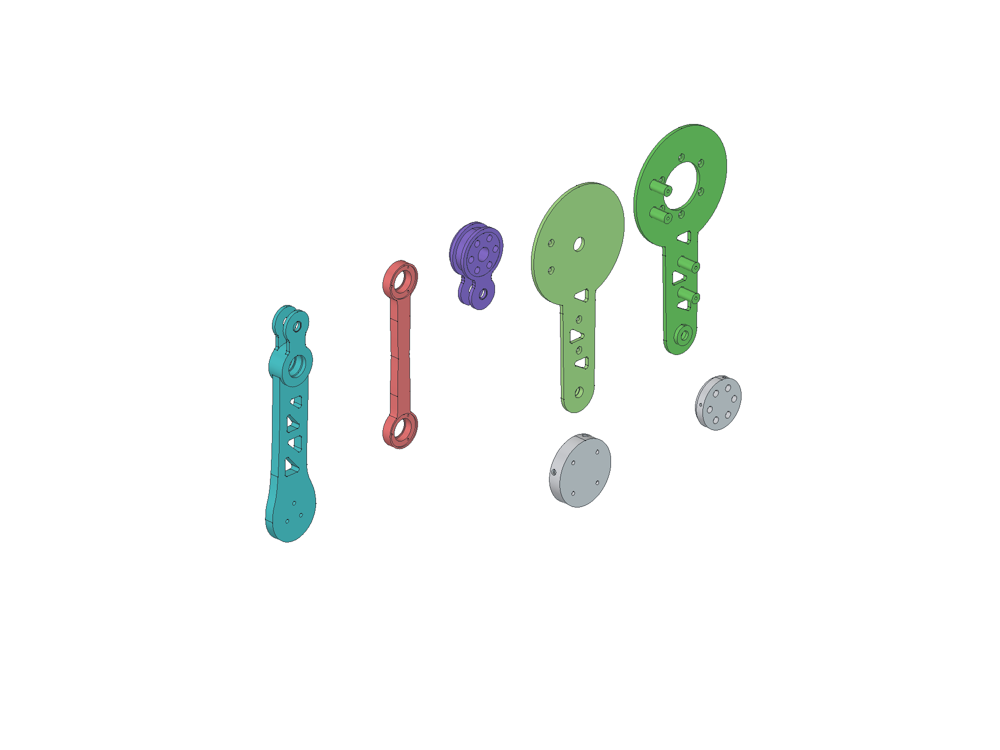

# V5 双腿轮足：完整外框包裹的一体叉连杆

本版按参考图重新拆件：每腿的 **OB 是内外两片完整框板，OA 放在两片 OB 之间；OA 与 CW 各自加工成一体叉，AC 两端嵌入叉口，CW 的 B 轴承舌嵌入 OB 两侧支承**。双剪由金属轴两端的实际支承形成。每个 A/B/C 关节仅使用一颗 626 轴承，双剪不要求两颗轴承。

关键承载件采用 6061-T6 CNC；中空机身的上舱、顶盖、托盘及相机支架采用 PETG。髋与膝均为用户确认的 **24 V、V1.1 驱动版本 J4310**，轮端为 H6215，删除参考图的髋横滚与普通足端。当前整机预算约5.58 kg。按CAD分布质量，标称姿态和120 mm低蹲的每侧膝重力需求分别约1.96、2.46 N·m；平地低速运行具备初算可行性，**跳跃能力尚不能确认**。完整条件与限制见 [MOTOR_LOAD.md](MOTOR_LOAD.md)。

## 从参考图到实际分件

先看 [参考图逐件拆分](reference_breakdown.md) 与 [轴向层次图](previews/reference_breakdown.svg)。五个主要连杆 CNC 件如下；轴、轴承、铜套和保持片另计。

| 每腿实体 | 复用的结构关系 | V5 的实际做法 |
|---|---|---|
| `OB_inner_full` | 完整 O→B 内板 | 电机接口、B 内支承和四个框间连接柱一体加工 |
| `OB_outer_full` | 完整 O→B 外板 | 连续覆盖 OA；B 外支承向内伸入，四颗螺钉与内板合框 |
| `OA_one_piece` | O→A 紫色曲柄 | 转子座与 A 两个耳合为一个 CNC 件，嵌在 OB 里面 |
| `AC_bearing_link` | A→C 红色连杆 | 连续曲线杆身；两端各一颗轴承及独立外圈保持片 |
| `CW_one_piece` | C、B、W 同一刚体 | C 双耳、背桥、B 轴承舌与轮端连接一体加工，取消外加 C 帽与长螺钉柱 |



图中上排从左到右为CW、AC、OA、OB外板、OB内板；下排为两件法兰。这是独立零件审查排布，不是真实装配位置。可打开 [分件FreeCAD](part_breakdown.FCStd)、[分件STEP](part_breakdown.step)；对照 [右腿爆炸图](previews/right_leg_exploded.png) 和 [拆盖查看OA内嵌](previews/OA_inside_OB.png)。

130/35 mm 是关节中心距：OB=AC=BW=130，OA=BC=35。外形采用连续圆弧、过渡曲线和保留承载边的开窗；零件分界不根据图片颜色臆造。参考图被遮挡的轴向保持件由本版明确设计，其尺寸不宣称来自原图。

## 更薄的轴向结构

腿部承载件总宽 **22 mm**，以膝前定子面 S=132.1 为基准：OB 内板 S..S+3，外板 S+19..S+22；OA/CW 两耳分别为 S+3.5..6.5 和 S+15.5..18.5。AC 与 B 中央舌为 S+7..15。OA 外耳位于 OB 外盖内侧，采用真正的内嵌结构，不靠几片零件在外侧继续叠厚。

三处被动轴均为 Ø6 钢轴、两侧铜套支承，单颗 NSK626ZZ1（6×19×6）通过肩部和螺钉保持片固定外圈。钢轴两端使用 M2 内螺纹和超薄头保持件防脱，轴向留明确游隙；不得将薄保持螺钉当作主要剪切承载轴。完整层面、轴孔和铜套尺寸见 [INTERFACES.md](INTERFACES.md)。

髋转子与膝定子间保留两件 CNC 法兰，轴向总跨度 **14.9 mm**：带三根真实 Ø4 定位销的转子法兰，嵌入外 Ø57 的膝定子杯内，套合长7；四颗径向螺钉穿过杯壁进入插芯螺纹。使用 NBK 小头低头螺钉缩短连接，不能直接换成普通高头。详见 [法兰剖面与验证](coupling_review.md)。

轮端固定面 Y147.1，右 H6215 平移 Y189.1，输出面 Y191.6；轮心 Y173.1、轮距 **346.2 mm**。这些值与22 mm连杆和新膝电机位置配套，不能混用 V4 的轮端位置。

## 中空机身及设备布置

机身外廓 **200×150×135 mm**（Z−50..85）。五片金属下壳到 Z47，PETG 上舱到 Z82，可拆顶盖到 Z85；PETG 电子托板上表面 Z33。五片下壳实际铣兜减重后共 **793.044 g**，同一基型关闭减重兜为964.016 g，减少170.972 g。此数只包括五片金属下壳。

完整 Jetson Orin Nano 主机按最大103.2×90.7×35.86 mm包络布置，接口朝+X；D435嵌入前上面板，正面与X100齐平。电池暂按400 g、110×50×35 mm，IMU暂按20 g、25×30×12 mm。四个设备实体是尺寸占位，不是原厂完整CAD或最终安装支架。

D435 后部两颗 M3×5 通过3 mm支架名义入牙2 mm，低于原厂最大3 mm；相机支架通过机身四孔Y±50、Z56/72连接。相机/Jetson来源、线头空间和未定设备假设见 [payload_interfaces.json](payload_interfaces.json)。具体壳体分件、通风孔、金属攻牙和装配顺序见 [CHASSIS.md](CHASSIS.md)。

## 文件与工艺

- [整机预览](previews/assembly.png)、[开舱设备布局](previews/electronics_layout.png)、[关节剖面](previews/joint_sections.png)：用于先检查结构和装配层次。
- [原生 FreeCAD 装配](wheel_leg_v5.FCStd)：含位置表达式、原始电机及设备占位，适合分组查看和修改参数。
- [完整装配 STEP](wheel_leg_assembly.step) 与 [结构装配 STEP](wheel_leg_structure.step)：供交换和检查；供应商按单件工艺文件制造。
- [整机装配 STL](wheel_leg_assembly.stl)：已保留装配位置，含242个对象、1,723,230个三角面，约86.16 MB；外廓235.17×391.20×318.81 mm。用于整机多壳查看，不作为一体打印文件；[导出回读报告](assembly_stl_report.json)。
- [零件清单](parts.csv)、[零件几何/工艺清单](part_manifest.json)、[设计参数](design_parameters.json)：文件名、数量、材料和层面的依据。
- `cnc/`：金属主体单件 STEP。左右件按文件分开，尤其杯件不能随意翻面互换。
- `print/`：PETG 附件的独立 STL，已放置到打印平台。默认220×220×250 mm、0.4 mm喷嘴、0.2 mm层高。上舱相机窗口、侧通风长槽与悬挑螺母柱需局部支撑；模型闭合检查不等于免支撑。需要按实际打印机复核孔配合、方向并清理支撑。
- `stl/`：结构单件的查看网格。CNC件的STL不是金属加工图，也不表示允许将其改为PETG承载件。
- [自制轴/保持件规格](metal_hardware/specification.json) 与 [法兰销、螺钉规格](coupling_fasteners.json)：包括加工小五金和标准件需求；[Ø4×9定位销STEP](metal_hardware/dowel_D4_L9.step)为名义圆柱，全机6枚，原料截短、端部倒角和固定/可拆端配合应在加工图中注明。

本版主制造清单为 **22个CNC STEP、23件金属主体；5个PETG STL、5件附件**，加工小五金和采购件另列。装配体 STL 已输出，包含原始电机、已建五金、轮胎和四个设备包络；打印使用独立PETG STL。真实螺纹在加工STEP中主要以底孔表示，必须依接口说明攻牙；不能将底孔径当作成品螺纹。

## 装配要点

1. 先安装 AC 两端和 CW 的 B 轴承；装外圈保持片及三颗 M2 螺钉，再进入叉口。先检查轴承可转动和保持片只接触外圈。
2. **在 OB 框外**装好 OA–AC 的 A 轴双端保持件，再完成 AC–CW 的 C 轴连接。OA 装进 OB 后，A 内側 T4 工具会被完整内板挡住。
3. 髋板、电机两件法兰及膝电机按专项说明装好；将 OB 内板固定到膝前定子，把预装子机构插入内框，装 OA 六颗 M3×16 转子螺钉。
4. 对齐 B 轴与 OB 两侧铜套支承，装外盖及四颗 M3×8；完成 B 双端保持。OB 外盖的 Ø12 中心孔不能用于穿过 PCD27 安装全部 OA 螺钉，维修 OA 时应拆盖。
5. 安装 H6215、轮圈和轮胎；完成机身、电子件、相机及线束，最后固定上舱与顶盖。全程检查轴端游隙、轴承转动、螺钉露牙和电机接线空间。

## 最终验证与载荷状态

- [完整几何检查](validation.json)：腿长120..225 mm、每5 mm一档，共22姿态，β=0；包含已建硬件间检查，无超过0.05 mm³相交。所有导出主体为有效实体，网格闭合。
- [原生硬件随动检查](native_hardware_placement_validation.json)：202个硬件对象在120、183.847763、225 mm三个姿态与计算位置一致，0.001 mm位置阈值内无错误。
- [PETG打印网格检查](print_mesh_validation.json)：5个STL全部通过闭合、非流形、自相交、法向和220×220×250 mm平台检查。
- [质量预算](mass_budget.json)：整机名义 **5.580 kg**，安装/打印/轮胎等不确定性范围约 **5.380..5.880 kg**；该范围不是统计置信区间。包含完整Jetson、D435、400 g电池、20 g IMU占位及0.2 kg安装余量；PETG按CAD实心体积估算，最终须称量。

[电机负载与跳跃筛查](MOTOR_LOAD.md)已分别列出集中质量近似与CAD分布质量结果；后者计入下肢重心和轮端非簧载质量。低蹲重力需求约2.46 N·m尚有有限额定余量，但未计平衡控制峰值、冲击及热负载；本次J4310按已确认的24 V、V1.1驱动版本分析，不能用3/7 N·m额定/峰值数值直接保证跳跃。离散β=0检查未覆盖任意机身倾角、连续路径最小间隙、弹性变形、线缆扫掠或未建螺钉；几何无相交不证明跳跃冲击、疲劳或螺纹强度满足要求。

## 重建

在工程根目录使用系统 FreeCAD Python：

```sh
/Applications/FreeCAD.app/Contents/Resources/bin/python tools/build_enclosed_robot.py
/Applications/FreeCAD.app/Contents/Resources/bin/python tools/render_enclosed_robot.py
/Applications/FreeCAD.app/Contents/Resources/bin/python tools/export_robot_assembly_stl.py --revision v5
/Applications/FreeCAD.app/Contents/Resources/bin/python tools/validate_print_meshes.py --revision v5
```

`--integration-check` 仅运行120、183.847763和225 mm三个姿态用于快速整合，不可替代不带该参数的最终完整检查。原始电机参考文件必须保留在项目上层 `references/` 中。V5输出独立放在本目录，V4归档保持不变。
