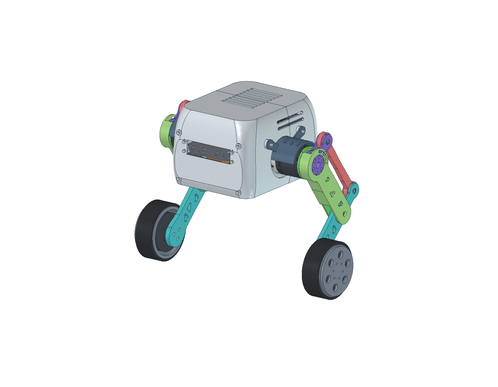
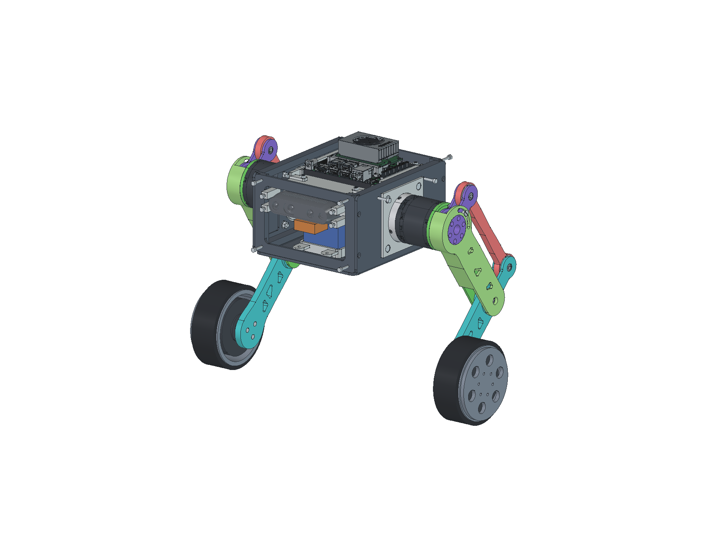

# V6 双腿轮足：包覆式 OB 与曲面中空机身

本版对应用户确认的 **24 V、V1.1 驱动 J4310** 髋/膝电机，轮端为 H6215。关键承载件采用6061-T6铝合金CNC；整高曲面外壳、托盘及相机支架采用PETG。V5文件保留。

## 腿部修改

- **OB=AC=130、BW=105、OA=BC=45 mm**。BW由130缩短19.2%，OA/BC由35加长28.6%；名义髋轮距180，几何检查范围100～215。
- O端外径由旧大圆盘缩到 **Ø57**，与真实膝电机定子一致。先装内承载臂，再将OA穿过中央开口连接转子，最后套入带连续侧壁、定位台阶和背面口袋的OB外壳。
- A/C的轴承舌嵌进OA/CW两叉耳之间，B轴承舌嵌进OB两支承之间；每处一颗626轴承，金属轴两端受支撑。CW的C、B、W保持一个CNC刚体。
- 主轴向结构宽 **23 mm**；外侧限位销头局部达到24.7 mm。V5主结构为22 mm，本版增加1 mm以实现Ø57头部真实包覆、必要间隙和独立止挡，不能称作全局又减薄1 mm。
- 外侧O圆孔有同轴台阶，OA轮毂径向单边留0.20、轴向留0.40；它是间隙保护/防脱结构，不是新增承重滑动轴承。另设R23弧槽和可拆Ø4钢肩销限制角度。
- 两件髋转子—膝定子嵌套法兰沿用已核对的14.9 mm轴向设计；定位销、径向锁紧孔与原始电机孔系保留。

先看 [参考图拆件](reference_breakdown.md)、[接口与公差说明](INTERFACES.md) 和 [制造/装配顺序](leg_construction_notes.md)。原图隐藏尺寸未被当作可测数据；本版尺寸来自真实电机、参数设计及几何检查。



## 设备与机壳

机身采用重新布置的金属承力内框与整高连续曲面中空外壳，取消叠在原方壳上方的独立上舱。左右弧形肩部延伸到膝电机区域；底部及运动侧留出连杆摆动和维护空间。外罩不承担腿部冲击载荷。

**Jetson和D435均安装在机壳内部**。D435位于连续前面板中，中心Z19、正面X100，光学窗口保持开放；Jetson位于机身内部中后方，保留原底座、风扇和散热器，并设置独立托盘与可拆固定件；电池留在低位。设备布局与实际机壳尺寸见 [CHASSIS.md](CHASSIS.md)。

- Jetson使用[NVIDIA官方完整开发套件STEP](https://developer.nvidia.com/downloads/assets/embedded/secure/jetson/orin_nano/docs/jetson_orin_nano_devkit_3d_step_model.zip/)，版本20230320。保留1393个实体，包含P3768载板、P3767模块包络、风扇、散热器和底座；仅排除辅助开放曲面，未缩放实体。原件和校验记录在 `source/jetson/`。
- D435的[官方CAD包](https://dev.realsenseai.com/docs/cad-files/)提供SolidWorks格式，原件保存在 `source/d435/`。FreeCAD装配和整机STL纳入[RealSense官方ROS详细网格](https://github.com/realsenseai/realsense-ros/blob/ros2-master/realsense2_description/meshes/d435.dae)，不是原来的方盒视觉占位。网格保留原拓扑，未补洞或缩放外形。
- **D435版本差异已明确处理**：2018官方ROS模型深25.05 mm，2025尺寸图为26.05 mm。本次可视装配按旧网格设后安装面X74.95，支架面X73.95，中间加可拆1 mm金属垫片，两颗M3×6名义入牙2 mm。26.05 mm实物去掉垫片并改M3×5。下单前按实物确认版本与后安装面。
- 电池仍按用户指定400 g、假定110×50×35 mm矩形；IMU暂按20 g、25×30×12 mm。二者明确标为包络，不冒充原厂模型。



## 文件用途

| 文件 | 用途 |
|---|---|
| [wheel_leg_v6.FCStd](wheel_leg_v6.FCStd) | 原生装配，含位置表达式、原厂电机、Jetson实体、D435官方网格和设备安装件 |
| [wheel_leg_assembly.stl](wheel_leg_assembly.stl) | 保持装配位置的整机多壳查看模型，包含真实设备模型；不用于整机一体打印 |
| [wheel_leg_structure.step](wheel_leg_structure.step) | 制造结构装配，不含采购电子设备 |
| [wheel_leg_assembly.step](wheel_leg_assembly.step) | BRep交换装配；Jetson是真实实体，D435在此STEP中为有明确标注的安装检查包络；相机原厂SLDPRT另附 |
| [part_breakdown.FCStd](part_breakdown.FCStd) / [STEP](part_breakdown.step) | 五类腿部主体及两件式法兰，共七个主件的独立查看排布 |
| [leg_exploded_review.FCStd](leg_exploded_review.FCStd) | 右腿爆炸查看，不是装配位置 |
| [parts.csv](parts.csv) / [part_manifest.json](part_manifest.json) | 零件、数量、材料和网格状态 |
| `cnc/*.step` | 承重金属主体，左右件分别输出 |
| `stl/*.stl` | CNC零件的参考网格，用于查看或试配；承重成品按金属工艺加工 |
| `print/*.stl` | PETG独立打印件，按220×220×250 mm平台检查 |
| `metal_hardware/` | 金属轴、衬套、保持片、限位销和调节垫片参考形状/规格 |

PETG默认0.4 mm喷嘴、0.2 mm层高。曲面罩、螺母穴和长通风槽可能需要支撑；实际切片、孔配合和材料耐温需按打印机确认。CNC螺纹多以底孔表达，必须按接口说明攻牙，不能把底孔当成最终通孔。名义CAD不替代带公差、牙深及表面处理要求的加工工程图。

## 已做的检查与适用边界

[O接口独立审查](O_interface_independent_review.json)检查原电机孔系、工具路径、螺纹芯通道、套壳过程及角度止挡。**只能按180 mm名义姿态执行所给轴向装壳路径**；100 mm深蹲姿态中途会擦碰，禁止强行套入。

理想止挡首次接触角为−135.747°/−47.753°，相应髋轮距约217.90/97.83 mm。接触时AC到壳仍留0.858/0.443 mm，止挡先于主体碰撞。正常控制限位须保持在100～215 mm工作范围内；止挡不用于反复冲击制动。

整机最终几何、打印网格、质量和电机负载见：

- [整机运动相交检查](validation.json)、[硬件随动](native_hardware_placement_validation.json)、[机壳检查](chassis_review.json)。
- [独立PETG网格检查](print_mesh_validation.json)、[整机STL导出回读](assembly_stl_report.json)。
- [质量预算](MASS.md)、[24V电机负载及跳跃筛查](MOTOR_LOAD.md)。

最终质量预算约 **5.642 kg**。名义180 mm姿态每膝重力负载约 **1.641 N·m**，采样最大约 **2.259 N·m**；低速平地力矩筛查可行。100 mm落差、50 mm缓冲的膝负载粗筛约 **6.866 N·m**，已接近7 N·m峰值，因此不能把静态余量视为跳跃/落地通过。

本版运动检查是固定β=0的离散姿态检查，不覆盖任意机身倾角、连续运动最小间隙、线缆扫掠或弹性变形。电机负载计算不等于跳跃能力证明；峰值转矩不能与空载最高转速同时使用。未沿用V5的旧OB截面抗压结果，新包覆壳的跳跃冲击、疲劳、螺纹承压和热性能尚待验证。

## 重建

在本工程根目录，使用系统FreeCAD Python：

```sh
/Applications/FreeCAD.app/Contents/Resources/bin/python tools/build_sleeved_robot.py
/Applications/FreeCAD.app/Contents/Resources/bin/python tools/render_sleeved_robot.py
/Applications/FreeCAD.app/Contents/Resources/bin/python tools/analyze_v6_motor_load.py
/Applications/FreeCAD.app/Contents/Resources/bin/python tools/export_robot_assembly_stl.py --revision v6
/Applications/FreeCAD.app/Contents/Resources/bin/python tools/orient_v6_prints.py
/Applications/FreeCAD.app/Contents/Resources/bin/python tools/validate_print_meshes.py --revision v6
python3 tools/package_sleeved_robot.py
```

原始电机STEP仍使用工程旁的 `../references/DM-J4310-2EC` 与 `../references/DM-H6215`。官方电子设备源文件和派生缓存已随V6提供。MuJoCo的几何、质量惯量及控制参数没有自动替换为V6；原仿真测试结果不能作为V6实机验证。
